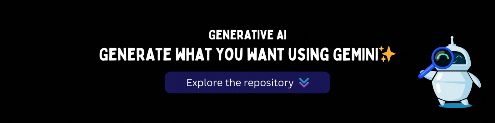

## Overview

[**Generative AI**](https://om-ghante-generative-ai.vercel.app/) is a MERN stack project that harnesses the power of the Gemini API to deliver advanced AI functionalities. This repository demonstrates the seamless integration of AI with modern web technologies, creating a responsive and dynamic platform without the need for complex machine learning models.

## Features

- This Project is not completed yet

## Technologies Used

- **Frontend**: React.js, Tailwind CSS, Material Tailwind
- **Backend**: Node.js, Express.js
- **Database**: MongoDB
- **AI Integration**: Google Gemini API
- **Deployment**: Vercel [frontend](https://om-ghante-generative-ai.vercel.app/), [backend](https://generative-ai-server.vercel.app/)

## Getting Started

To get started with Generative AI locally, follow these steps:

### Prerequisites

- Node.js and npm installed
- MongoDB installed or access to a MongoDB Atlas instance (No Need for this version!)

### Installation

1. **Clone the Repository**

   ```bash
   git clone https://github.com/om-ghante/Generative-AI.git
   ```

2. **Change the work derectory**

   ```bash
   cd Generative-AI
   ```

3. **Frontend setup**

   ```bash
   cd client
   npm install
   ```

4. **Backend setup**

   ```bash
   cd ../server
   npm install
   ```

5. **Configure Environment Variables for fronted**

   ```bash
   VITE_SERVER_API=http://localhost:6173
   ```
   
6. **Configure Environment Variables for backend**

   ```bash
   ORIGIN_API=http://localhost:5173
   GOOGLE_API_KEY=your_google_api_key_here
   SERVER_PORT=6173
   ```

7. **Start the Development Servers**

   ```bash
   cd client
   npm run dev
   ```

8. **Start the Development Servers**

   ```bash
   cd ../server
   npm run dev
   ```

## Access the Application

Open your web browser and navigate to `http://localhost:${PORT}` to view the Generative AI application.

## Contributing
- Contributions are welcome! To contribute to the Generative AI project:
- Fork the repository.
- Create a new branch for your feature or fix.
- Make your changes and commit them.
- Open a pull request with a clear description of your updates.

## License
 This project is not licensed under any License.

## Contact
 For any questions or feedback, please contact me at omghante.work@gmail.com

<div align="right">
   
</div